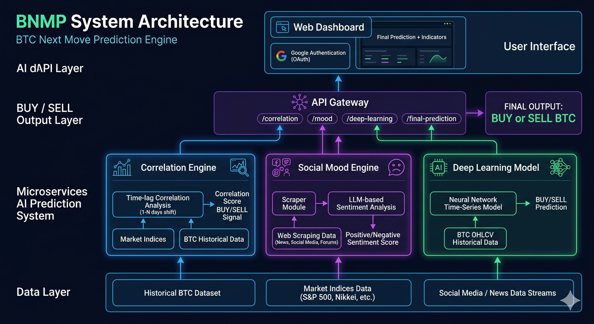

# BNMP — BTC Next Move Prediction

BNMP (BTC Next Move Prediction) is a high-level predictive system designed to forecast the next-day movement of **Bitcoin**. The goal is to optimize profit and loss (PnL) by combining multiple independent signal engines into a unified daily prediction.

---

## What

BNMP predicts the **next-day BTC market direction**:

* **BUY** or **SELL**

Each prediction is generated daily and exposed through APIs for external consumption and dashboard visualization.

---

## Why

The system is built to:

* Improve trading decision quality
* Optimize PnL through multi-signal confirmation
* Reduce reliance on a single predictive method
* Combine quantitative + behavioral + AI-based signals

---

## How (System Overview)

BNMP is composed of three independent “micro-app indicators”, each producing a daily signal. These signals are aggregated to generate the final prediction.

---

## 1. Correlation Engine

This module identifies financial instruments correlated with BTC over time.

### Method

* Analyze real-time and historical market data
* Compute correlation between BTC and global indices (e.g. S&P 500, Nikkei 225)
* Apply time shifts (1 → N days lag)
* Identify strongest lagged correlations

### Output

* Correlation summary (API endpoint)
* Final signal: **BUY / SELL**

### Behavior

* Runs once per day
* Exposed via API:

  * `/correlation/summary`
  * `/correlation/signal`

---

## 2. Social Mood (Sentiment Engine)

This module measures market sentiment around BTC.

### Architecture

* **Scraper Layer**

  * Collects BTC-related content from internet sources (social platforms, news, forums)
* **LLM Analysis Layer**

  * Processes text data
  * Extracts sentiment signals (positive / negative)

### Output

* Sentiment score or classification:

  * **Positive**
  * **Negative**

### Behavior

* Runs once per day
* Exposed via API:

  * `/mood/raw-data` (scraper output)
  * `/mood/sentiment` (LLM result)

---

## 3. Deep Learning Prediction Model

This module uses historical BTC price behavior to predict next-day movement.

### Dataset Structure

| BTC Day n-1 (OHLCV)              | BTC Day n |
| -------------------------------- | --------- |
| [open, high, low, close, volume] | Up        |
| [open, high, low, close, volume] | Down      |

### Method

* Train deep learning model on full BTC history since inception
* Learn temporal market patterns
* Predict next-day movement

### Output

* **BUY / SELL**
* Model confidence

### Implementation

* Developed and trained in Google Colab
* Served as an inference API

---

## System Outputs (Daily Signals)

Each module produces:

* Correlation Signal → BUY / SELL
* Mood Signal → Positive / Negative
* Deep Learning Signal → BUY / SELL

A final aggregation layer can combine all signals into a unified trading decision.

---

## Web Application

### Authentication

* Users sign in via **Google OAuth**

### Dashboard Flow

After authentication, the system automatically:

1. Calls all three APIs (Correlation, Mood, Deep Learning)
2. Aggregates latest daily outputs
3. Displays:

   * Individual indicator results
   * Final predicted BTC direction
   * (Optional) confidence / breakdown per model

---

## API Summary

| Module        | Endpoint              | Output              |
| ------------- | --------------------- | ------------------- |
| Correlation   | `/correlation/signal` | BUY / SELL          |
| Mood          | `/mood/sentiment`     | Positive / Negative |
| Deep Learning | `/dl/predict`         | BUY / SELL          |
| Aggregator    | `/predict/final`      | Final decision      |

---

## Execution Model

* All modules run **once per day**
* Results are cached and exposed via API
* Web dashboard consumes APIs in real time after user login
* Designed for extensibility (new indicators can be added as micro-apps)

---

## Goal

BNMP is designed as a modular intelligence layer for BTC forecasting, combining:

* Quantitative correlation analysis
* Real-world sentiment extraction
* Machine learning prediction systems

to produce a structured, API-driven trading signal system.

## System Architecture
